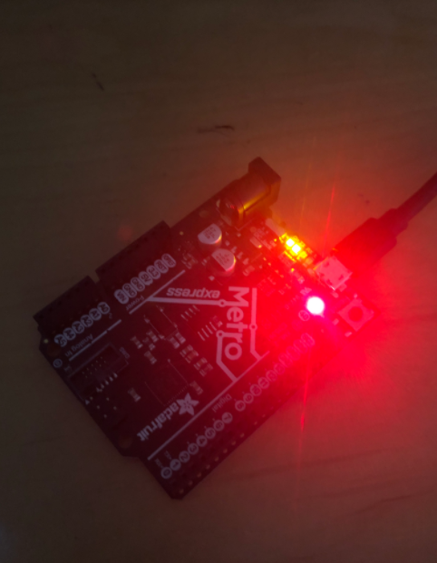

# CircuitPython
## Hello Circuit Python 
### Description

This was an introduction to Circuit Python using an Arduino Metro. I used the Caret text editor and uploaded a code that caused a red light to glow on the Metro board. 

### Evidence

```C++
import board
import neopixel //board and neopixel libraries added to circuit py


dot = neopixel.NeoPixel(board.NEOPIXEL, 1)


print("Make it red!") //serial monitor print


while True:
     dot.fill((50,0,0)) //loop controlling brightness of LED

 ```

### Image




### Reflection
 
Lessons Learned:

- In order to upload code to the Metro from Caret, you must first type it into the Caret platform, save it as a .py file, and then connect the board and drag the code file into the CIRCUITPY section of the files application. 
- To edit the code while it is connected to the Arduino, open the file in Caret, edit it, and then press save with the new changes. 
- "while True:" is basically the Circuit Python version of Void Loop. 
- You must import information into the Circuit Python code in order for it to understand specific functions. (i.e. import board, import time, import neopixel) 
- Eject Arduino from files (by clicking up arrow next to CIRCUIT PYTHON) before unplugging it. 
- Helpful website I used to figure everything out: [Adafruit: Using Circuit Python on a Chromebook](https://learn.adafruit.com/using-circuit-playground-express-makecode-circuitpython-on-a-chromebook/caret-editor) 
